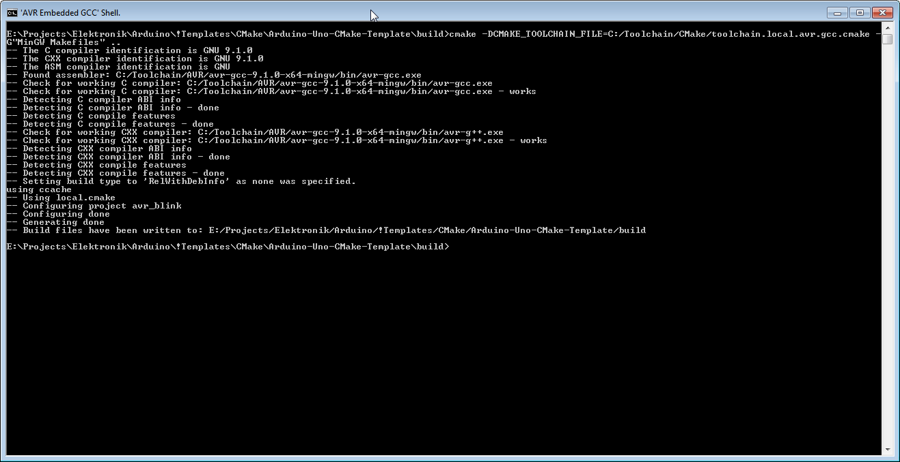
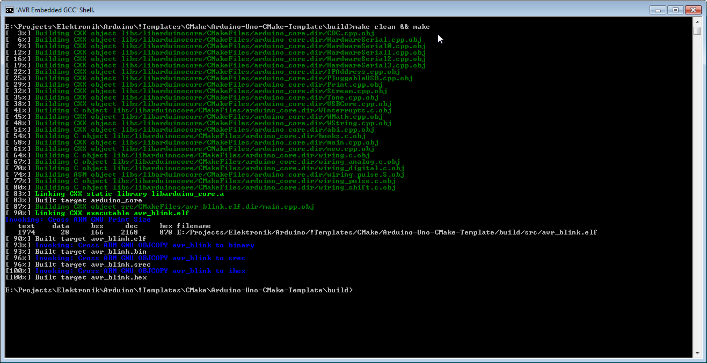
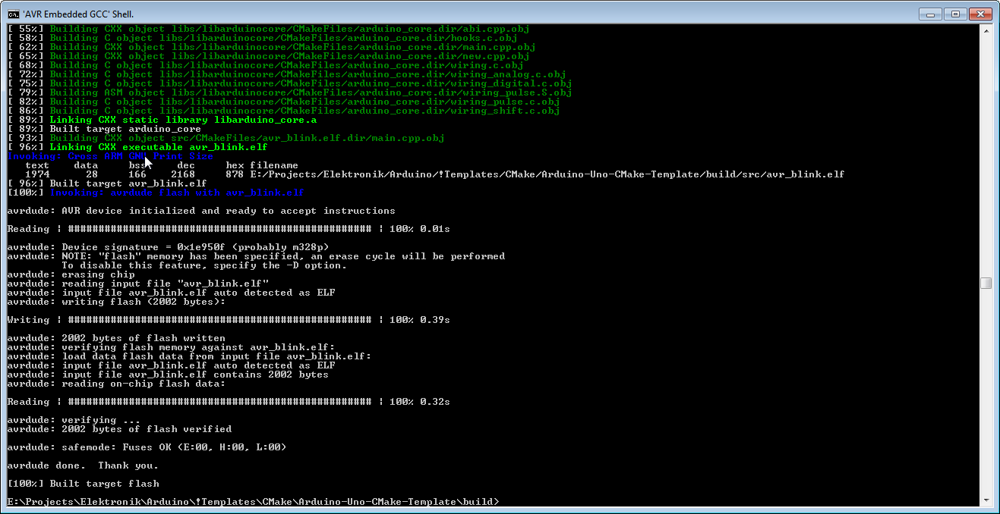
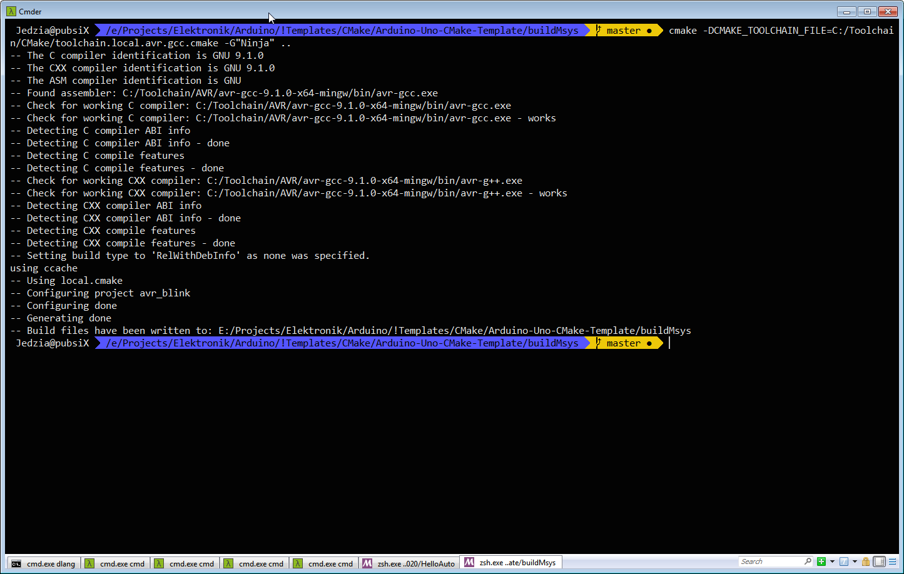
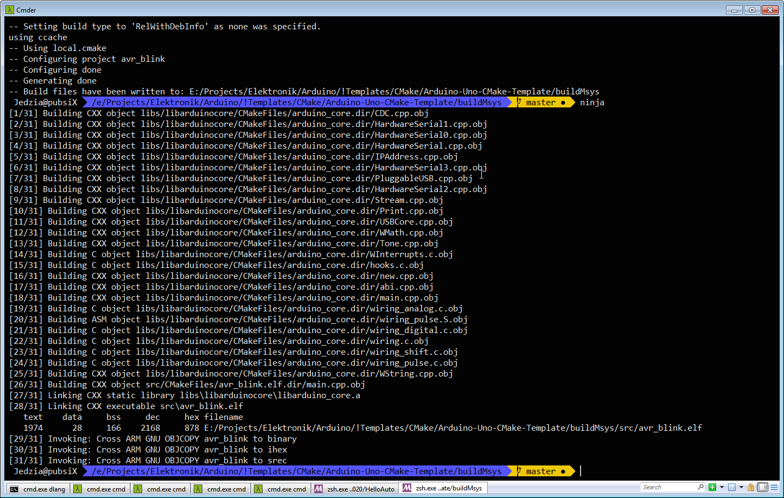
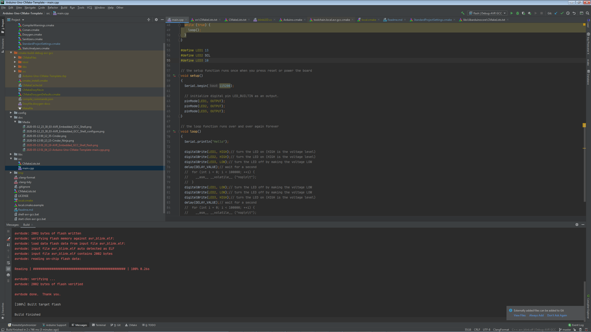
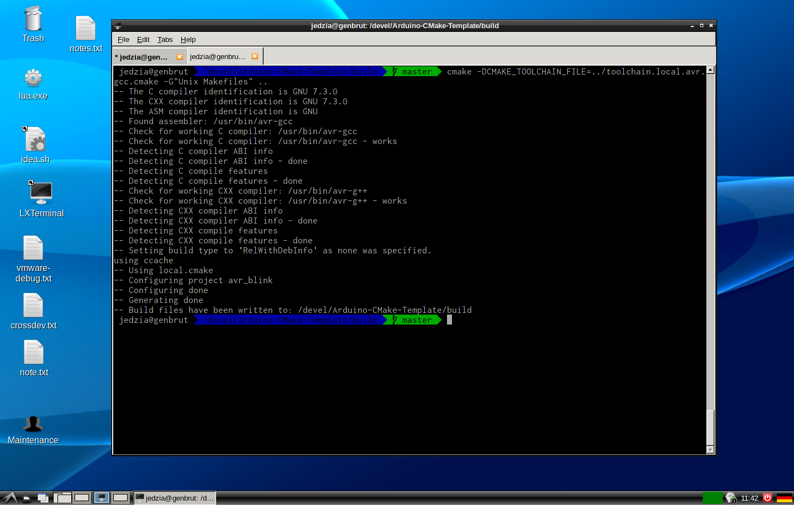
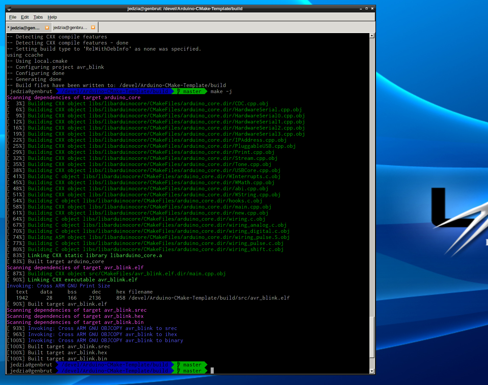

# Yet another Arduino CMake Template #    

I have my Arduino-IDE, why would i use this?
- A **one second build-time** for a simple blink project like this? (Including the Arduino Library!).
  Actually i got 0.4s build time with ninja under Gentoo-Linux, see "Running in Gentoo with Ninja" 
  at the very bottom ...
- Use an IDE that also deserves the name. (Code completion, the simplest essentials etc. ...)
- Customization. For gods sake, use the tools the compiler provides. Like warnings, sanitizers,
  formatters. The possibility to use command line switches and settings. You should be the one 
  in charge!
- Ever heard of Doxygen? Ah, i see. This is why the quality of Arduino code and snippets
  is so "high"... 

> All paths used are individual and function as an example. You have to provide your settings
> and the correct location of the tools on your machine.

## Setup & Build ##
Setup `local.cmake` by using `local.cmake.example` as template and create a toolchain file with your
preferences and paths (see toolchain.local.avr.gcc.cmake, below).

    E:\Projects\Elektronik\Arduino\!Templates\CMake\Uno-CMake-Template\build>
    cmake -DCMAKE_TOOLCHAIN_FILE=C:/Toolchain/CMake/toolchain.local.avr.gcc.cmake -G"MinGW Makefiles" ..  
	# or with the provided toolchain example file
    cmake -DCMAKE_TOOLCHAIN_FILE=../toolchain.local.avr.gcc.cmake -G"MinGW Makefiles" ..  
	cmake-gui -DCMAKE_TOOLCHAIN_FILE=C:/Toolchain/CMake/toolchain.local.avr.gcc.cmake -G"MinGW Makefiles" ..

    make
    make help
    make -j
	make clean && make -j
	make 

### MSys: ### 

    ✘ Jedzia@pubsiX  /e/Projects/Elektronik/Arduino/!Templates/CMake/Arduino-CMake-Template/buildMsys   master ● 
    # add the compiler to your system PATH	
    export PATH=$PATH:/c/Toolchain/AVR/avr-gcc-9.1.0-x64-mingw/bin
    cmake -DCMAKE_TOOLCHAIN_FILE=../toolchain.local.avr.gcc.cmake -G"MSYS Makefiles" ..  
	# or use a toolchain file with absolute paths(tweak with your settings here)
    cmake -DCMAKE_TOOLCHAIN_FILE=C:/Toolchain/CMake/toolchain.local.mingw64.avr.gcc.cmake -G"MSYS Makefiles" ..
    make -j

    # ninja has problems with ccache, there is an option to turn ccache off: 
    cmake -DCMAKE_TOOLCHAIN_FILE=C:/Toolchain/CMake/toolchain.local.mingw64.avr.gcc.cmake -GNinja -DENABLE_CCACHE:BOOL=OFF ..
    ninja

See the example `toolchain.local.mingw64.avr.gcc.cmake` below (the second one with *.mingw64.* in it).

### Gentoo Linux: ### 
	
	jedzia@genbrut /devel/Arduino-CMake-Template/build $ 
	cmake -DCMAKE_TOOLCHAIN_FILE=../toolchain.local.avr.gcc.cmake -G"Unix Makefiles" ..
	make 

or with ninja:

	cmake -DCMAKE_TOOLCHAIN_FILE=../toolchain.local.avr.gcc.cmake -GNinja ..
	ninja

Under Gentoo Linux with avr-gcc i used the same `toolchain.local.avr.gcc.cmake` below with success. You have to tweak the flash targets
for linux as i wasnt able to put this together yet. Oh, make a PR then, thanks;)
	
### CLion: ###
Set `-DCMAKE_TOOLCHAIN_FILE=C:/Toolchain/CMake/toolchain.local.avr.gcc.cmake` as CMake-Options and 
provide a avr-gcc toolchain under Toolchains.

### Example `toolchain.local.avr.gcc.cmake` ###

I use this setup when building under a windows command shell with a "MinGW Makefiles"
CMake-Generator. All tools have to be in the environment search **PATH**. 

    set(CMAKE_SYSTEM_NAME Generic)
    set(CMAKE_SYSTEM_PROCESSOR avr)
    set(CMAKE_FIND_ROOT_PATH_MODE_PROGRAM NEVER)
    set(CMAKE_FIND_ROOT_PATH_MODE_LIBRARY ONLY)
    set(CMAKE_FIND_ROOT_PATH_MODE_INCLUDE ONLY)
    set(CMAKE_FIND_ROOT_PATH_MODE_PACKAGE ONLY)
    
    set(SIZE avr-size)
    set(OBJCOPY avr-objcopy)
    set(OBJDUMP avr-objdump)

    set(CMAKE_C_COMPILER avr-gcc)
    set(CMAKE_CXX_COMPILER avr-g++)
    
    set(CMAKE_AR avr-gcc-ar)
    set(CMAKE_C_ARCHIVE_CREATE "<CMAKE_AR> qc <TARGET> <LINK_FLAGS> <OBJECTS>")
    set(CMAKE_CXX_ARCHIVE_CREATE "<CMAKE_AR> qc <TARGET> <LINK_FLAGS> <OBJECTS>")
    
    set(CMAKE_RANLIB avr-gcc-ranlib)
    
    #set(CMAKE_EXE_LINKER_FLAGS_INIT "--specs=rdimon.specs")

You may set the relative paths (or without a path at all, like above) and set the compiler `/bin`
in your **PATH** or specify it like `set(CMAKE_C_COMPILER C:/tools/avr-gcc/avr-gcc.exe)` to have
a independent toolchain setup. This is totally at your liking.

### Example `toolchain.local.mingw64.avr.gcc.cmake` ###

This variation of the above toolchain setup has full paths specified and can work independently.
I use this when building with MSYS2 in a MSYS2 shell.  

    set(CMAKE_SYSTEM_NAME Generic)
    set(CMAKE_SYSTEM_PROCESSOR avr)
    set(CMAKE_FIND_ROOT_PATH_MODE_PROGRAM NEVER)
    set(CMAKE_FIND_ROOT_PATH_MODE_LIBRARY ONLY)
    set(CMAKE_FIND_ROOT_PATH_MODE_INCLUDE ONLY)
    set(CMAKE_FIND_ROOT_PATH_MODE_PACKAGE ONLY)
    
    set(SIZE C:/Toolchain/AVR/avr-gcc-9.1.0-x64-mingw/bin/avr-size.exe)
    set(OBJCOPY C:/Toolchain/AVR/avr-gcc-9.1.0-x64-mingw/bin/avr-objcopy.exe)
    set(OBJDUMP C:/Toolchain/AVR/avr-gcc-9.1.0-x64-mingw/bin/avr-objdump.exe)
    
    set(CMAKE_C_COMPILER C:/Toolchain/AVR/avr-gcc-9.1.0-x64-mingw/bin/avr-gcc.exe)
    set(CMAKE_CXX_COMPILER C:/Toolchain/AVR/avr-gcc-9.1.0-x64-mingw/bin/avr-g++.exe)
    
    set(CMAKE_AR C:/Toolchain/AVR/avr-gcc-9.1.0-x64-mingw/bin/avr-gcc-ar.exe)
    set(CMAKE_C_ARCHIVE_CREATE "<CMAKE_AR> qc <TARGET> <LINK_FLAGS> <OBJECTS>")
    set(CMAKE_CXX_ARCHIVE_CREATE "<CMAKE_AR> qc <TARGET> <LINK_FLAGS> <OBJECTS>")
    
    set(CMAKE_RANLIB C:/Toolchain/AVR/avr-gcc-9.1.0-x64-mingw/bin/avr-gcc-ranlib.exe)
    
    #set(CMAKE_EXE_LINKER_FLAGS_INIT "--specs=rdimon.specs")

### Options ###	
	
## Some Visual Impressions ## 

* Windows Shell CMake configuration    
  
* Windows Shell running make
  
* Windows Shell flashing an Uno
  

* MSYS2 CMake Configuration
  
* MSYS2 running ninja  
  

* CLion flashing an Uno  
  

* Linux CMake Configuration
  
* Linux running make  
  
  

# Development Notes #    

A build cycle snapshot:

    E:\Projects\Elektronik\Arduino\!Templates\CMake\Arduino-CMake-Template\build>make clean && make
    [  3%] Building CXX object libs/libarduinocore/CMakeFiles/arduino_core.dir/CDC.cpp.obj
    [  6%] Building CXX object libs/libarduinocore/CMakeFiles/arduino_core.dir/HardwareSerial.cpp.obj
    [  9%] Building CXX object libs/libarduinocore/CMakeFiles/arduino_core.dir/HardwareSerial0.cpp.obj
    [ 12%] Building CXX object libs/libarduinocore/CMakeFiles/arduino_core.dir/HardwareSerial1.cpp.obj
    [ 16%] Building CXX object libs/libarduinocore/CMakeFiles/arduino_core.dir/HardwareSerial2.cpp.obj
    [ 19%] Building CXX object libs/libarduinocore/CMakeFiles/arduino_core.dir/HardwareSerial3.cpp.obj
    [ 22%] Building CXX object libs/libarduinocore/CMakeFiles/arduino_core.dir/IPAddress.cpp.obj
    [ 25%] Building CXX object libs/libarduinocore/CMakeFiles/arduino_core.dir/PluggableUSB.cpp.obj
    [ 29%] Building CXX object libs/libarduinocore/CMakeFiles/arduino_core.dir/Print.cpp.obj
    [ 32%] Building CXX object libs/libarduinocore/CMakeFiles/arduino_core.dir/Stream.cpp.obj
    [ 35%] Building CXX object libs/libarduinocore/CMakeFiles/arduino_core.dir/Tone.cpp.obj
    [ 38%] Building CXX object libs/libarduinocore/CMakeFiles/arduino_core.dir/USBCore.cpp.obj
    [ 41%] Building C object libs/libarduinocore/CMakeFiles/arduino_core.dir/WInterrupts.c.obj
    [ 45%] Building CXX object libs/libarduinocore/CMakeFiles/arduino_core.dir/WMath.cpp.obj
    [ 48%] Building CXX object libs/libarduinocore/CMakeFiles/arduino_core.dir/WString.cpp.obj
    [ 51%] Building CXX object libs/libarduinocore/CMakeFiles/arduino_core.dir/abi.cpp.obj
    [ 54%] Building C object libs/libarduinocore/CMakeFiles/arduino_core.dir/hooks.c.obj
    [ 58%] Building CXX object libs/libarduinocore/CMakeFiles/arduino_core.dir/main.cpp.obj
    [ 61%] Building CXX object libs/libarduinocore/CMakeFiles/arduino_core.dir/new.cpp.obj
    [ 64%] Building C object libs/libarduinocore/CMakeFiles/arduino_core.dir/wiring.c.obj
    [ 67%] Building C object libs/libarduinocore/CMakeFiles/arduino_core.dir/wiring_analog.c.obj
    [ 70%] Building C object libs/libarduinocore/CMakeFiles/arduino_core.dir/wiring_digital.c.obj
    [ 74%] Building ASM object libs/libarduinocore/CMakeFiles/arduino_core.dir/wiring_pulse.S.obj
    [ 77%] Building C object libs/libarduinocore/CMakeFiles/arduino_core.dir/wiring_pulse.c.obj
    [ 80%] Building C object libs/libarduinocore/CMakeFiles/arduino_core.dir/wiring_shift.c.obj
    [ 83%] Linking CXX static library libarduino_core.a
    [ 83%] Built target arduino_core
    [ 87%] Building CXX object src/CMakeFiles/avr_blink.elf.dir/main.cpp.obj
    [ 90%] Linking CXX executable avr_blink.elf
    Invoking: Cross ARM GNU Print Size
       text    data     bss     dec     hex filename
       1974      28     166    2168     878 E:/Projects/Elektronik/Arduino/!Templates/CMake/Arduino-CMake-Template/build/src/avr_blink.elf
    [ 90%] Built target avr_blink.elf
    [ 93%] Invoking: Cross ARM GNU OBJCOPY avr_blink to binary
    [ 93%] Built target avr_blink.bin
    [ 96%] Invoking: Cross ARM GNU OBJCOPY avr_blink to srec
    [ 96%] Built target avr_blink.srec
    [100%] Invoking: Cross ARM GNU OBJCOPY avr_blink to ihex
    [100%] Built target avr_blink.hex
    
    E:\Projects\Elektronik\Arduino\!Templates\CMake\Arduino-CMake-Template\build>

Running in Gentoo with Ninja

	 jedzia@genbrut  /devel/Arduino-CMake-Template-linux/build   master  time ninja     
	[28/31] Linking CXX executable src/avr_blink.elf
	   text	   data	    bss	    dec	    hex	filename
	   1942	     28	    166	   2136	    858	/devel/Arduino-CMake-Template-linux/build/src/avr_blink.elf
	[31/31] Invoking: Cross ARM GNU OBJCOPY avr_blink to binary
	ninja  0.20s user 0.14s system 84% cpu 0.407 total
	 jedzia@genbrut  /devel/Arduino-CMake-Template-linux/build   master  
	
	